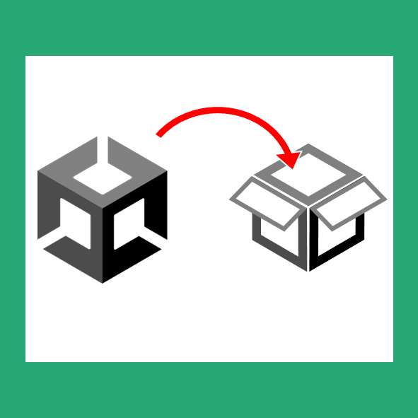
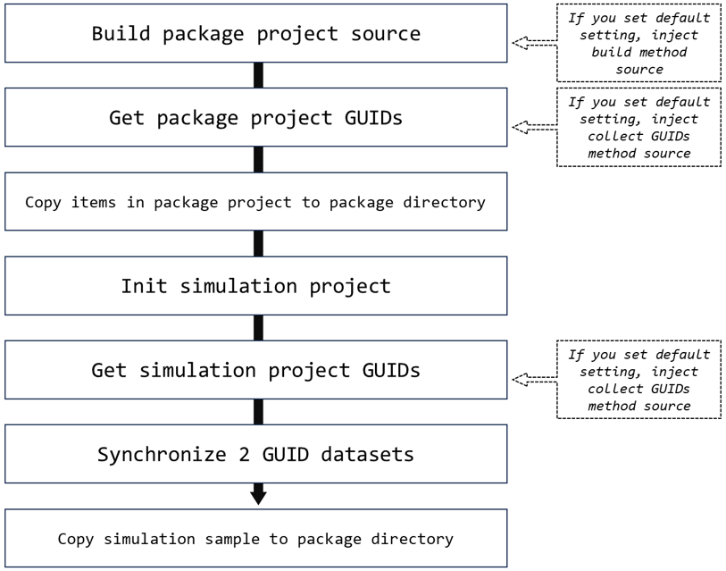
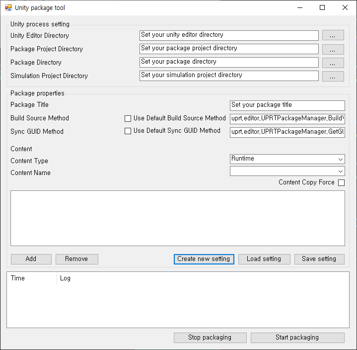
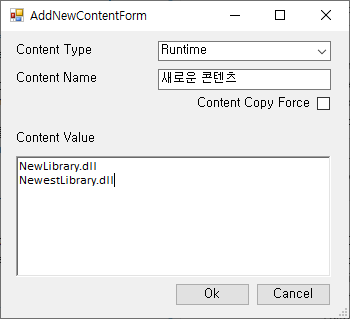
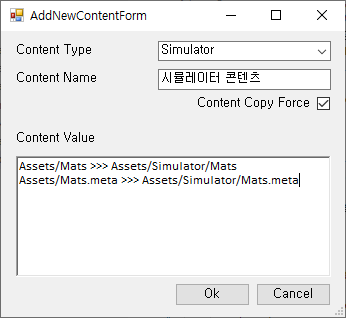

# Unity package release tool

## 목적



Unity Dll 기반 Package 배포를 관리할 수 있도록 구현된 툴입니다 (https://github.com/Kunnymann/unity-package-release-tool).

## 요약

여러분들은 GUI를 통해서 **Package를 작업하고 있는 프로젝트**로 부터, **Dll 기반 Unity local package**를 구성할 수 있습니다. 또한, 구성된 local package를 테스트하기 위해, **Simulation 프로젝트**로부터 유효성을 검증할 수 있습니다. 동시에, *부가적인 작업* (e.g. package sample)을 지원하기도 합니다.

기본적인 프로세스는 아래와 같습니다.



현재, 프로그램은 **Unity 2021의 기본 빌드 프로세스**를 따릅니다. 따라서, 각각 **PlayerDataCache에서 Runtime source**를, 그리고 **ScriptAssemblies에서 Editor**를 참조한 Dll을 수집해옵니다.

## 구성

### GUI 구성



#### Unity process setting

1. Unity Editor Directory : Unity Editor가 설치된 디렉토리 (*현재 2021 버전 혹은 그 이상 버전을 지원*)
2. Package Project Directory : Package 작업이 수행된 Unity 프로젝트 디렉토리
3. Package Directory : 배포될 Package 디렉토리
4. Simulation Project Directory : 배포될 Package 디렉토리를 Local package로 타겟하고 있는 테스트 목적의 Unity 프로젝트 디렉토리

#### Package properties

1. Package Title : Package 디렉토리의 **루트 폴더 이름**. 실제 package.json에 작성된 Package name을 찾거나, 기타 디렉토리를 구성하는데 사용.
2. Build Source Method : Process 인스턴스를 통해, Unity editor로 실행할 Build source method의 argument 값.
3. Sync GUID Method : Process 인스턴스를 통해, Unity editor로 실행할 Get GUIDs method의 argument 값.

```
2, 3번의 기본 설정을 활성화시키면, 프로그램이 각각 프로젝트로 기본 함수를 inject합니다.
기본 설정을 사용하지 않는다면, 각 프로젝트 별도로 함수들을 작성해 주셔야 합니다.
```
4. Content : Package내로 복사할 대상을 지정할 수 있습니다. 복사 방향에 따라, 5가지의 Content Type이 존재합니다.
    - Content Type
        - Runtime : Package project => Package runtime directory
        - Editor : Package project => Package editor directory
        - Simulator : Package project => Simulation project
        - Sample : Simulation project => Package sample directory
        - Package : Package project's package directory => Package directory
    - Content Name
        - Content 사이의 구분을 위한 라벨 용도의 필드
5. Add, Remove : 새로운 Content를 추가하거나, 기존에 있는 것을 삭제할 수 있습니다.
6. Create new setting : 새로운 Setting을 구성
7. Load setting : 기존 Setting을 구성
8. Save setting : 현재 메모리에 올라간 Setting을 저장하여, json 파일로 추출
9. Package log viewer : log viewer
10. Start & Stop : 패키징 작업을 시작하거나, 작업을 중단.

#### How to add content

Content 등록 방법은 크게 2가지 방식이 존재합니다.



Content Type이 *Runtime*, *Editor*인 경우는 복사될 위치가 고정적이므로, 파일명으로만 기술하여 복사 대상 아이템을 등록할 수 있습니다. 이 경우, 자동적으로 meta 파일을 찾아, 복사를 진행합니다.

**Content Copy Force**는 파일 존재 여부를 따지지 않고, 강제로 복사하는 속성입니다.

아이템은 Linebreak 단위로 구분됩니다.



그 밖의 Content Type은 비교적 자유롭게 복사할 수 있으며, `출발 위치 >>> 복사 위치`와 같은 형태로 작성될 수 있습니다. 이 경우, **meta 파일을 반드시 작성**해야 합니다.

기술된 내용이 디렉토리라면, 디렉토리 단위로 복사를 진행합니다.

## License

This package is under the MIT License.
